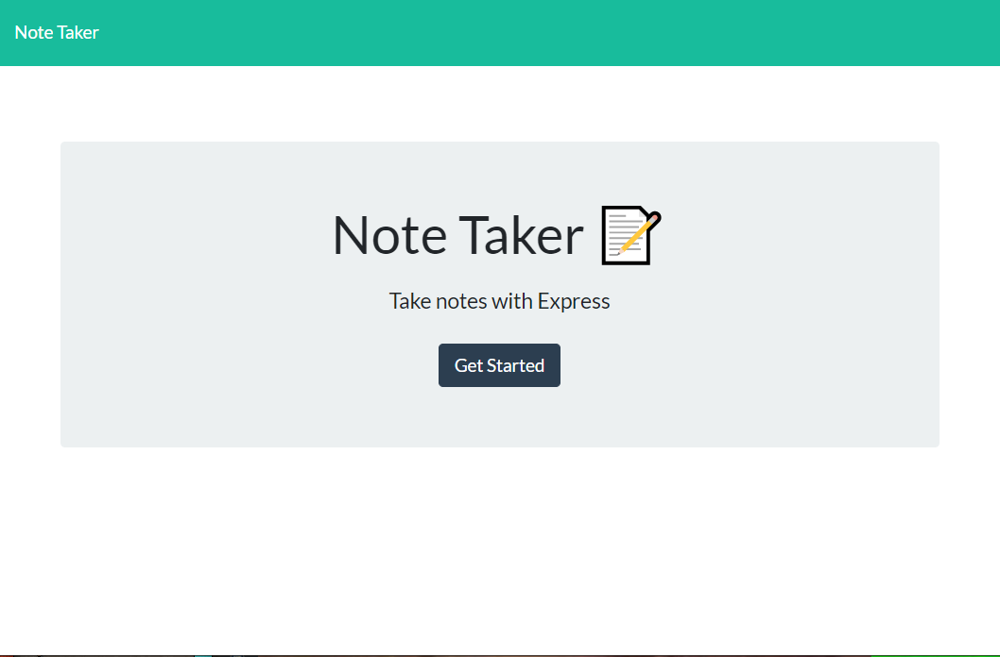
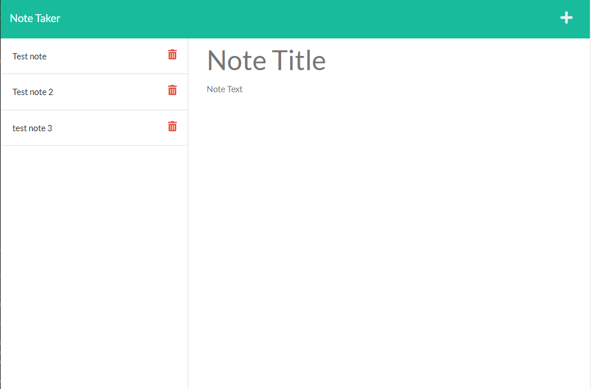

# note-taker

## Description
This program is to create a note taking program. It allows you to input notes, save those notes, select a note, as well as delete some notes. This project used 
express.js, and uuid npm packages.
## Installation
Clone repo, open repo, install dependincies using: npm i, run program from terminal with node index.js

## Screenshots

## link to deployed webpage
[Deployed webpage](https://note-take-andrew.herokuapp.com)
